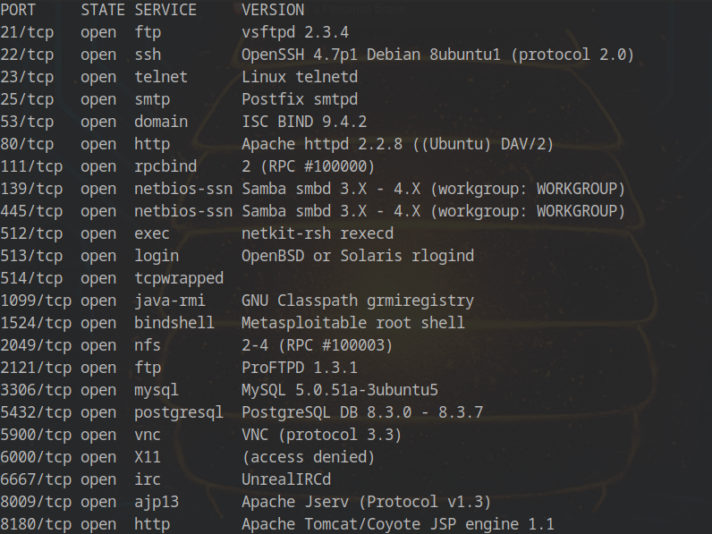
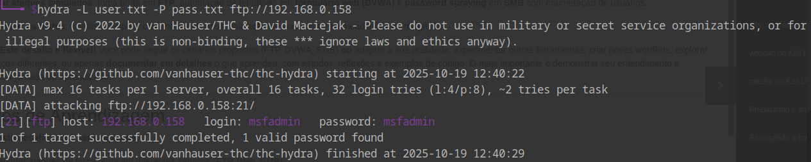
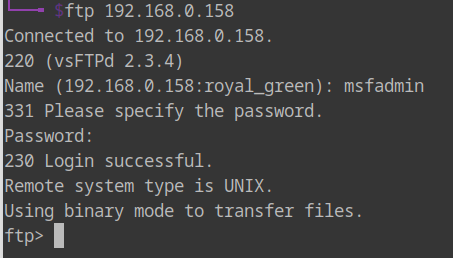
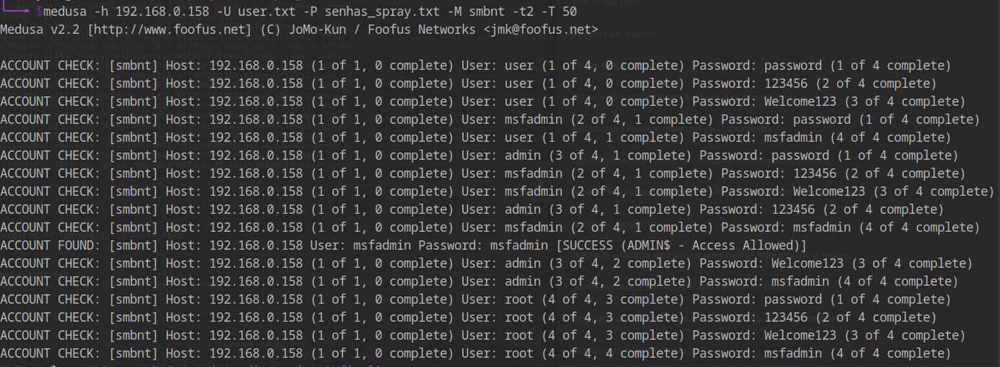
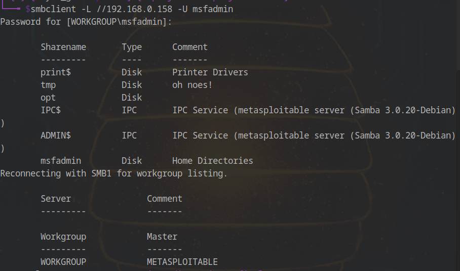
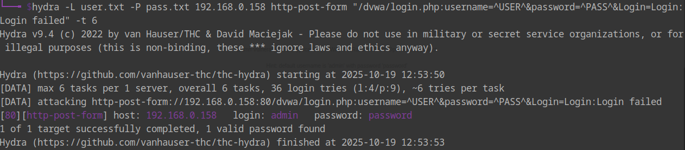
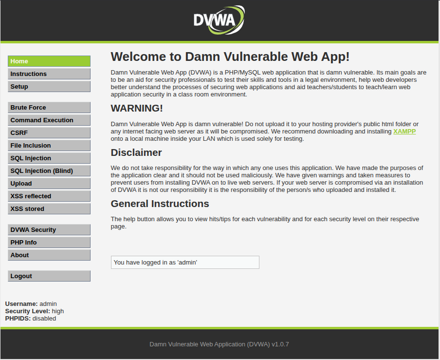

# Relatório de Teste de Invasão

## Introdução

Este relatório detalha as etapas e os resultados de um teste de invasão realizado em um ambiente de laboratório. O objetivo deste projeto foi identificar e explorar vulnerabilidades em serviços de rede comuns, como FTP, SMB e aplicações web, utilizando ferramentas de código aberto.

As fases do teste incluíram reconhecimento, enumeração de serviços, ataques de força bruta e documentação dos resultados.

## Fase 1: Reconhecimento e Varredura de Portas

A fase inicial do teste de invasão consistiu em uma varredura de portas para identificar os serviços ativos no alvo. Para esta etapa, foi utilizada a ferramenta **Nmap**.

### Varredura com Nmap

O Nmap foi executado para escanear as portas TCP do alvo, identificar as versões dos serviços em execução e detectar o sistema operacional.

**Comando:**
```bash
nmap -sC -sV -O <endereço_ip>
```

**Resultados:**
Os resultados completos da varredura do Nmap estão salvos no arquivo `nmap_output.txt`. A imagem a seguir é uma captura de tela da saída do Nmap.



A varredura revelou os seguintes serviços principais:
- **FTP:** Porta 21
- **SMB:** Porta 445
- **HTTP:** Porta 80 (executando uma aplicação web, possivelmente DVWA)

## Fase 2: Enumeração de Serviços

Com base nos serviços identificados, a próxima fase foi a enumeração para coletar mais informações sobre os alvos, como nomes de usuários e compartilhamentos de rede.

### Enumeração SMB com Enum4linux

A ferramenta **Enum4linux** foi utilizada para enumerar o serviço SMB.

**Comando:**
```bash
enum4linux -a <endereço_ip>
```

**Resultados:**
A saída completa do Enum4linux está disponível no arquivo `enum4linux_output.txt`. Uma lista de usuários extraída desta enumeração foi salva em `enum4linux_users.txt`.

## Fase 3: Ataques de Força Bruta

Nesta fase, foram realizados ataques de força bruta contra os serviços autenticados (FTP, SMB e a aplicação web) para tentar obter acesso não autorizado. Foram utilizadas as ferramentas **Hydra** e **Medusa**.

As listas de palavras utilizadas nos ataques foram:
- `wordlist_users.txt` (lista de usuários)
- `wordlist_passwords.txt` (lista de senhas)
- `wordlist_passwords_spray.txt` (lista de senhas para password spraying)

### Ataque de Força Bruta no FTP com Hydra

**Comando:**
```bash
hydra -L wordlist_users.txt -P wordlist_passwords.txt ftp://<endereço_ip>
```

**Resultados:**
O ataque foi bem-sucedido. A saída do Hydra está no arquivo `hydra_ftp_output.txt`.



A imagem a seguir comprova o acesso bem-sucedido ao serviço FTP.



### Ataque de Força Bruta no SMB com Medusa

**Comando:**
```bash
medusa -h <endereço_ip> -U users.txt -P senhas_spray.txt -M smbnt -t2 -T 50
```

**Resultados:**
O ataque ao SMB também obteve sucesso. A saída completa do Medusa pode ser encontrada em `medusa_smb_output.txt`.



A imagem abaixo demonstra o acesso bem-sucedido.



### Ataque de Força Bruta na Aplicação Web (DVWA) com Hydra

**Comando:**
```bash
hydra -L wordlist_users.txt -P wordlist_passwords.txt <endereço_ip> http-post-form "/dvwa/login.php:username=^USER^&password=^PASS^&Login=Login:Login failed"
```

**Resultados:**
O ataque de força bruta contra a página de login do DVWA foi bem-sucedido. Os resultados estão documentados em `hydra_dvwa_output.txt`.



A imagem a seguir mostra o login bem-sucedido na aplicação.



## Conclusão

O teste de invasão demonstrou com sucesso a presença de múltiplas vulnerabilidades críticas no ambiente alvo. A utilização de senhas fracas permitiu o acesso não autorizado a todos os serviços testados (FTP, SMB e a aplicação web).

Este projeto serve como um exemplo prático de como as ferramentas de segurança podem ser utilizadas para identificar e explorar fraquezas em sistemas, reforçando a importância de políticas de senhas fortes e da configuração segura de serviços de rede.

## Recomendações de Segurança

Depois de ver como foi fácil invadir esses sistemas, aqui vão algumas dicas para não passar pelo mesmo perrengue:

- **Crie senhas mais espertas:** Em vez de "123456" ou "password", que tal usar uma frase que só você conhece? Misture letras maiúsculas, minúsculas, números e símbolos. Quanto mais longa e maluca, melhor!

- **Não use a mesma senha para tudo:** A gente sabe que é um saco ter que lembrar de várias senhas, mas se um serviço for invadido, os outros continuam seguros. Use um gerenciador de senhas para te ajudar nessa missão.

- **Cuidado com serviços abertos para a internet:** Deixar serviços como FTP e SMB abertos para qualquer um ver é como deixar a porta de casa aberta. Se você não precisa que eles estejam na internet, simplesmente desative.

- **Mantenha tudo atualizado:** Programas e sistemas desatualizados são um prato cheio para hackers. Ative as atualizações automáticas sempre que possível.
